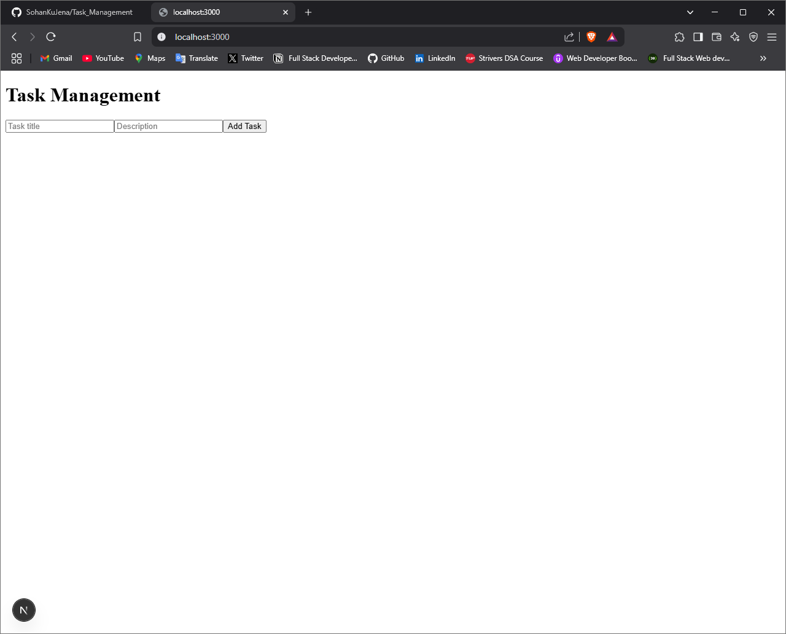

###Installation & Setup Instructions
  
  Follow the steps below to set up and run the Task Management Web App.
### **1️⃣ Clone the Repository**
First, open Git Bash or a terminal and clone the project from GitHub:
```sh
git clone https://github.com/SohanKuJena/Task_Management.git
cd task-manager
### Setup the Backend
cd backend
npm install
npm start

### Setup the Frontend
cd ../frontend
npm install
npm run dev

###Document API Endpoints with request/response formats
**Create a New Task**
- Endpoint: POST /tasks
- Request Body:
```json
{
  "title": "New Task",
  "description": "Description of the task"
}
- Response:
```json
{
  "id": "123",
  "title": "New Task",
  "description": "Description of the task",
  "completed": false
}

**Update a Task**
- Endpoint: PUT /tasks/:id 
- Request Body:
```json
{
  "title": "Updated Task",
  "completed": true
}
- Response:
```json
{
  "id": "123",
  "title": "Updated Task",
  "description": "Description remains",
  "completed": true
}

**Delete a Task**
- Endpoint: DELETE /tasks/:id
- Response: 
```json
{ "message": "Task deleted successfully" }

### Add Testing Instructions (Postman & Curl)
## Testing the API
### **Using Postman**
1. Open **Postman**
2. Send a **GET** request to `http://localhost:5000/tasks`
3. For a **POST request**, go to the **Body → raw → JSON** and add:
```json
{
  "title": "Learn Next.js",
  "description": "Build a task management app"
}
4. Click Send and check the response.

### Screenshots
## Task Manager Homepage
- 
